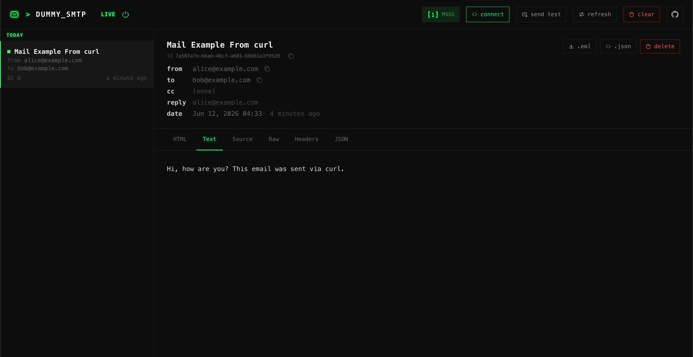

# Dummy SMTP

A development mail-catcher: a fake SMTP server that accepts mail from any app
pointed at it, stores it in memory, and exposes a web UI and JSON API to inspect
captured messages. **Nothing is ever relayed outbound** — it's for local
development and testing only.

Built in **Go**, shipped as a single binary with the web UI (Svelte) embedded.



## Features

- Catches mail over a minimal SMTP subset (no AUTH, no TLS) — point any app at it
- Web UI to browse captured messages (HTML / Text / Source / Raw / Headers / JSON)
- Responsive HTML preview with light/dark background
- JSON API to list, fetch and delete messages
- Live updates over Server-Sent Events
- Single Go binary with the UI embedded

## Getting started

```bash
go run ./cmd/dummy-smtp
```

This starts:

- **SMTP** on `:1025` — point your app's mail config here
- **Web UI / API** on `:8025` — open http://localhost:8025

Build a standalone binary:

```bash
go build ./cmd/dummy-smtp
```

## Configuration

| Env var     | Default | Description        |
| ----------- | ------- | ------------------ |
| `SMTP_ADDR` | `:1025` | SMTP listen address |
| `HTTP_ADDR` | `:8025` | Web/API listen address |

## Sending mail

Point any SMTP client at `localhost:1025` (no auth, no TLS). Quick test with
curl:

```bash
curl smtp://localhost:1025 \
  --mail-from alice@example.com \
  --mail-rcpt bob@example.com \
  -T <(printf 'Subject: Hello\n\nHi, how are you?\n')
```

More examples (Python, Go, Node, PHP, Ruby) live in [`example/`](example/) and in
the **connect** panel of the web UI.

## API

| Method   | Path                       | Description           |
| -------- | -------------------------- | --------------------- |
| `GET`    | `/api/v1/messages`         | List messages         |
| `GET`    | `/api/v1/messages/{id}`    | Get one message       |
| `DELETE` | `/api/v1/messages/{id}`    | Delete one message    |
| `DELETE` | `/api/v1/messages`         | Delete all messages   |

## License

MIT
